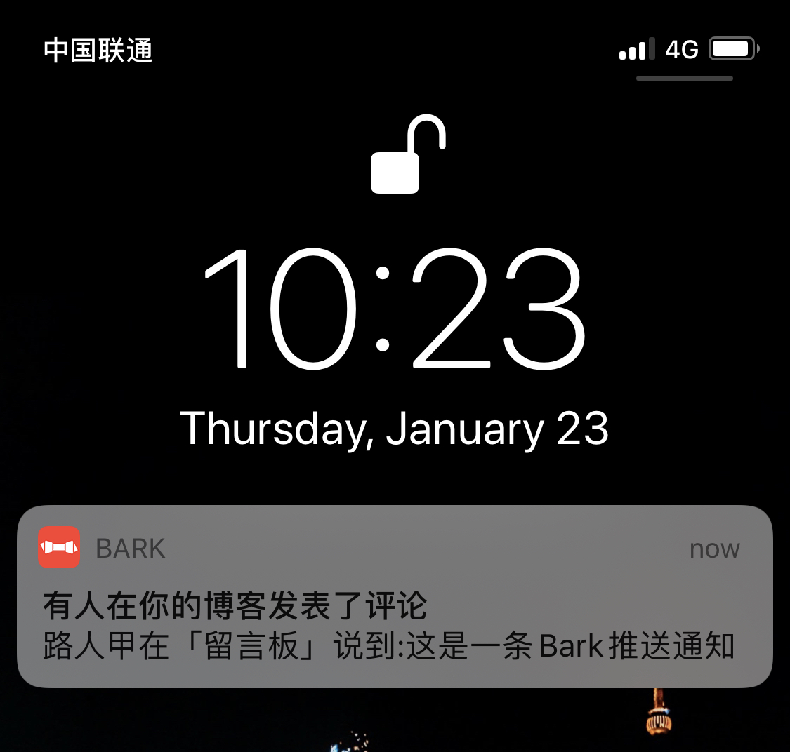

# Comment2Bark

> Typecho 插件——新评论Bark通知 

## 感谢
1. 本插件的推送采用了 [Fin](https://github.com/Finb/Bark) 的 [Bark]解决方案.
2. 1.2版本代码由[Comment2Bark](https://github.com/JDYuuki/Comment2Bark)修改而来

## 使用方法

 1. [点此下载](https://github.com/isSuperman/Typecho-Plugin-Comment2Bark/archive/refs/heads/master.zip)，将解压后的目录名改为 `Comment2Bark`，然后上传到你的 Typecho 的 `/usr/plugins`，并在 Typecho 后台开启插件
 2. 在App Store商店搜索【Bark】，下载打开后，提取https://api.day.app/后边的字符串
 3. 将你 `BARKKEY` 填到插件设置里，保存即可

## 配置选项
1. Bark Key - 必填项
2. Icon - （非必填）非必填推送消息图标URL，需iOS15+
3. Group - （非必填）推送消息分组
4. Sound - （非必填）推送铃声，具体参考 https://github.com/Finb/Bark/tree/master/Sounds
5. Server - （非必填）自建服务器需要填写，必须以**'/'**结尾
6. Archive - （非必填）值为1时保存，其他值为不保存，不填则保持默认

## 截图

## 更新记录
 - v1.0
   - init
 - v1.1
   - 适配最新版本Typecho1.2和PHP8+
   - 增加配置项，使用更灵活
